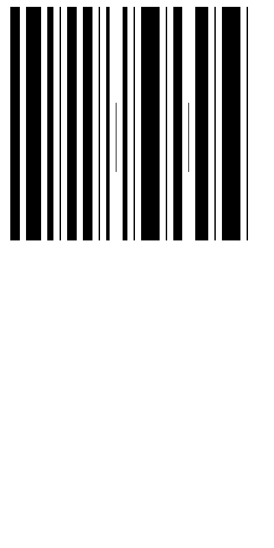

# Barcode Encoder & Decoder

A Python-based barcode encoding and decoding system that converts text to custom barcode images and vice versa.

## Overview

This project implements a simple barcode encoding scheme where each letter is represented by a vertical bar of varying width. The width of each bar corresponds to its position in the alphabet:
- A = 2 pixels wide
- B = 3 pixels wide
- ...
- Z = 27 pixels wide
- Space = 1 pixel wide (shorter bar)

## Files

| File | Description |
|------|-------------|
| `encode.py` | Converts text to barcode image |
| `decode.py` | Reads barcode image and extracts text |
| `Output.png` | Sample encoded barcode |

## Requirements

- Python 3.x
- Pillow (PIL)

```bash
pip install Pillow
```

## Usage

### Encoding Text to Barcode

```python
from encode import create_barcode

create_barcode("Hello World", "my_barcode.png")
```

Or run directly:
```bash
python encode.py
```

### Decoding Barcode to Text

```python
from decode import read_barcode

text = read_barcode("Output.png")
print(text)
```

Or run directly:
```bash
python decode.py Output.png
```

## Example

**Input Text:** `Muhammad Fazal Raza`

**Generated Barcode:**



**Decoded Output:** `MUHAMMAD FAZAL RAZA`

## How It Works

### Encoding
1. Each character is mapped to a bar width (letter position + 2)
2. Bars are drawn vertically on a white canvas
3. Spaces between bars are fixed at 9 pixel
4. Spaces in text are represented by 1-pixel short bars

### Decoding
1. Scans the middle row of the barcode image
2. Measures the width of each black bar
3. Converts bar width back to corresponding letter
4. 1-pixel bars are interpreted as spaces


